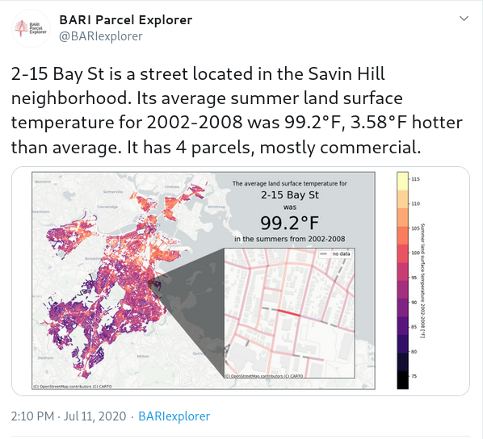

# bariexplorer-urbanheat

`bariexplorer-urbanheat` is a variant of the procedures used to run the [@BARIexplorer](https://twitter.com/bariexplorer) Twitter bot. `bariexplorer-urbanheat` was made to visualize data from and bring attention to a [recent paper](https://ajph.aphapublications.org/doi/abs/10.2105/AJPH.2020.305636) in the American Journal of Public Health. To learn more, visit [the relevant post on the BARI website](https://cssh.northeastern.edu/bostonarearesearchinitiative/2020/07/02/bariexplorer-beats-the-heat-tweeting-the-temperatures-of-bostons-streets/).

The full source code for the generation of tweet an images, along with links to data sources, can be found in the [generate_tweets.ipynb](generate_tweets.ipynb) Jupyter notebook. [bot.py](bot.py) is used to run the Twitter bot. Before the Twitter bot can be run, Twitter API keys must be pasted into [credentials.ini.template](credentials.ini.template), and that file should be renamed to `credentials.ini`.

As in [the original BARIexplorer code](https://github.com/BARIBoston/bariexplorer), the [BARI Geographical Infrastructure](https://dataverse.harvard.edu/dataset.xhtml?persistentId=doi:10.7910/DVN/WOT075) serves as the basis for street-level attributes, with the [2010 Boston Neighborhood Survey](https://dataverse.harvard.edu/dataset.xhtml?persistentId=doi:10.7910/DVN/SE2CIX) providing information about neighborhood sub-region bounds and the [2010 BostonGIS Neighborhood Boundaries](https://bostonopendata-boston.opendata.arcgis.com/datasets/3525b0ee6e6b427f9aab5d0a1d0a1a28_0) providing less granular information as a fallback.

All images are created using [geopandas](https://geopandas.org/), [matplotlib](https://matplotlib.org/), and [contextily](https://github.com/geopandas/contextily). `generate_images.py` will not run under the latest version of matplotlib - see `requirements.txt` for the appropriate version.
